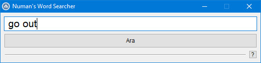
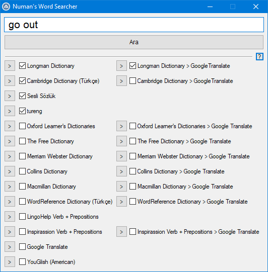

# Numan's Word Searcher #

English-Turkish Dictionary Websites Caller

## Overview ##

 "Ara" is the main button and calls multiple searches on checked sites at the same time. Also, that is done as well by the keyboard Enter key if the text area is selected. 

 The ">" mini-buttons call single search on the right side dictionary. 

 It is used the default internet browser. 

 To run, simply copy-paste the NWS.au3 content into the AutoIt editor.

## Overview (Türkçe) ##

 "Ara" temel tuş olup, işaretlenmiş tüm sitelerde birden arama işlemi tetikler. Ayrıca metin alanı seçiliyken Enter tuşu da bu işlevi görür. 

 ">" mini tuşları, bitişiğinde yer alan sözlükte arama işlemi tetikler. 

 Varsayılan internet tarayıcısını kullanır. 

 Çalıştırmak için AutoIt editörüne NWS.au3 içeriğinin kopyalanıp-yapıştırılması yeterlidir.

## Required-Tools ##

https://www.autoitscript.com/site/autoit/downloads/
 
https://www.autoitscript.com/cgi-bin/getfile.pl?autoit3/autoit-v3-setup.zip
